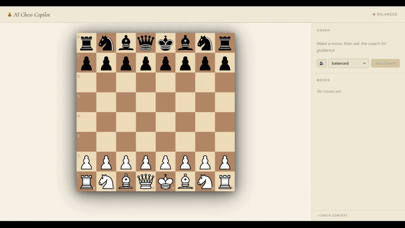
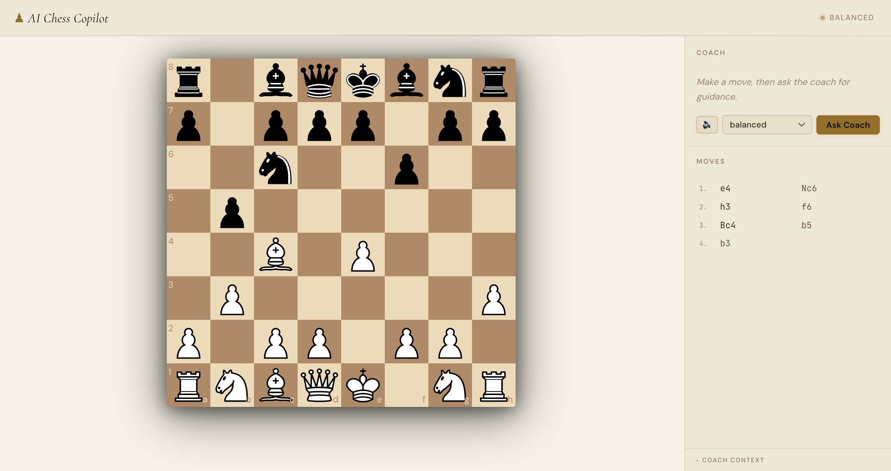
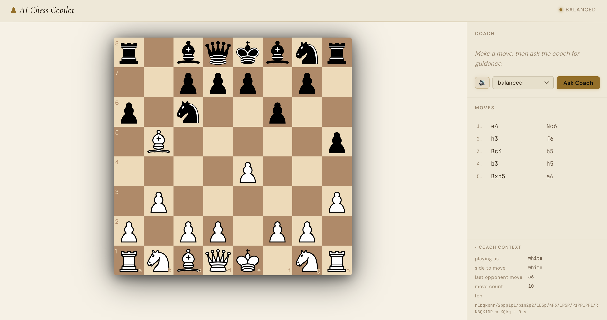
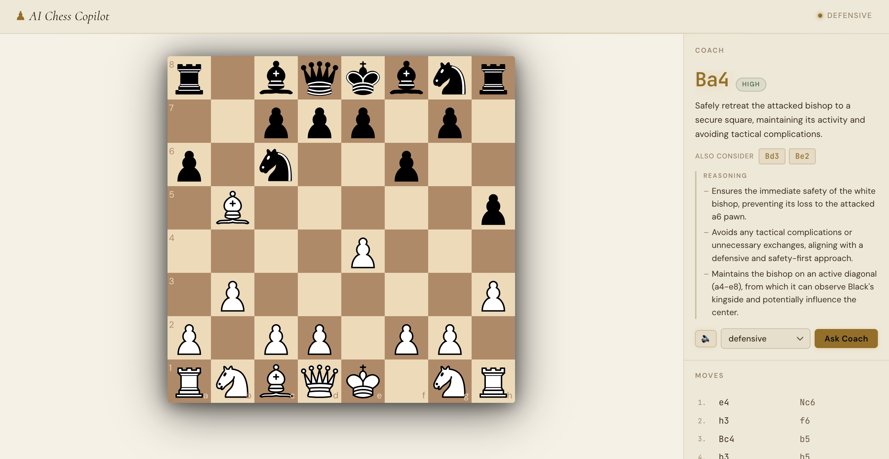

# ♟️ AI Chess Copilot

Real-time AI chess coach with streaming analysis.

## 🚀 Live Demo

👉 https://ai-chess-copilot-566371636656.europe-west2.run.app/

## 🎥 Demo



## ✨ Features

- Real-time streaming analysis (NDJSON)
- React + Vite frontend
- Node + Express backend
- Gemini-powered coaching

## 🖼️ Screenshots





## 🧠 Tech Stack

- React + TypeScript
- Node + Express
- Vertex AI (Gemini)
- Streaming (NDJSON)

The user plays White against themselves (or a friend on the same board). After the opponent moves, they click **Ask Coach** to get a streamed AI response with a recommended move, alternatives, reasoning, and risks — in a chosen coaching style (balanced / aggressive / defensive).

## Architecture

npm workspaces monorepo:

```
apps/
  web/      React + TypeScript frontend (Vite, port 5173)
  api/      Express 5 backend (TypeScript via tsx, port 3001)
packages/
  shared/   Shared TypeScript types (@ai-chess-copilot/shared)
```

**Frontend** (`apps/web/src/`):

| Module         | Responsibility                                                        |
| -------------- | --------------------------------------------------------------------- |
| `ChessBoard`   | Interactive board, legal move enforcement, drag-and-drop              |
| `CoachPanel`   | Streaming AI response, coaching mode selector, voice toggle           |
| `MoveHistory`  | Scrollable move list                                                  |
| `useGameState` | Board FEN, move history, side-to-move, opponent move detection        |
| `useSpeech`    | Web Speech API wrapper — female voice preference, async voice loading |
| `coachApi`     | `streamAnalysis()` — NDJSON streaming over POST                       |

**Backend** (`apps/api/src/`):

| Module                          | Responsibility                                                        |
| ------------------------------- | --------------------------------------------------------------------- |
| `routes/coach.ts`               | `POST /api/coach/analyze` — validates, routes to model or mock        |
| `services/chessContext.ts`      | Derives game phase, recent moves, context string from request         |
| `services/coachOrchestrator.ts` | Prompt construction, model call, output validation, retry/fallback    |
| `services/modelClient.ts`       | VertexAI (Gemini) client — structured JSON output via response schema |
| `services/mockCoach.ts`         | Mode-aware mock responses with simulated streaming delays             |
| `validation/coachRequest.ts`    | Request schema validation                                             |

**Request flow:**

```
Browser → POST /api/coach/analyze
  → validateCoachRequest
  → orchestrateCoachResponse (if VERTEX_PROJECT set)
      → deriveGameContext → buildPrompt → Gemini (structured JSON)
      → isValidOutput? → retry once with stronger instruction if not
      → toSafeResponse fallback if retry also fails
  → streamResponseAsNdjson (real) or streamMockResponse (mock)
  → NDJSON chunks → CoachPanel progressive render
```

## API

`POST /api/coach/analyze`

Streams `application/x-ndjson`. Each line is one JSON chunk:

```jsonc
// Chunks arrive progressively as the response is built:
{ "type": "move",         "value": "Nf3" }
{ "type": "alternatives", "value": ["Bc4", "d4"] }
{ "type": "confidence",   "value": "medium" }
{ "type": "summary",      "value": "Develop a piece and contest the center." }
{ "type": "reasoning",    "value": ["Nf3 develops naturally...", "..."] }
{ "type": "risks",        "value": ["Watch out for ...Bc5 targeting f2."] }
{ "type": "style",        "value": "balanced" }
```

Coaching modes: `balanced` | `aggressive` | `defensive` — shape the model prompt, not separate logic branches.

## 🤖 AI Integration

- Uses Gemini (Vertex AI) for real analysis
- Demo runs in **mock mode by default** for reliability
- Real model can be enabled via environment variables

This ensures:

- Consistent demo experience
- No dependency on API quotas or latency

## Setup

### 1. Install dependencies

```bash
npm install
```

### 2. Authenticate with Google Cloud

The API uses Vertex AI (Gemini) via [Application Default Credentials (ADC)](https://cloud.google.com/docs/authentication/application-default-credentials). You need the `gcloud` CLI installed and a GCP project with the Vertex AI API enabled.

```bash
# Install gcloud CLI: https://cloud.google.com/sdk/docs/install

# Log in and set up ADC
gcloud auth login
gcloud auth application-default login

# Set your active project
gcloud config set project YOUR_GCP_PROJECT_ID

# Enable the Vertex AI API (one-time per project)
gcloud services enable aiplatform.googleapis.com
```

ADC means no API key file is needed locally — the SDK picks up your credentials automatically.

### 3. Configure environment

```bash
cp .env.example .env
```

Edit `.env` and set `VERTEX_PROJECT` to your GCP project ID:

```
VERTEX_PROJECT=your-gcp-project-id   # required to enable real model calls
VERTEX_LOCATION=us-central1          # optional, defaults to us-central1
VERTEX_MODEL=gemini-2.5-flash        # optional, defaults to gemini-2.5-flash
```

**Without `VERTEX_PROJECT`** the API falls back to mock responses — no GCP account needed for local frontend development.

### 4. Run both apps

```bash
npm run dev
```

Frontend: http://localhost:5173  
API: http://localhost:3001

## Testing

Tests use [Vitest](https://vitest.dev/) across both apps.

```bash
# Run all tests (web + api)
npm test

# Run individually
npm run test:web
npm run test:api

# Watch mode (within a workspace)
npm --workspace apps/web run test
npm --workspace apps/api run test
```

Both test suites run in parallel on every pull request via GitHub Actions (see `.github/workflows/ci.yml`).

## Environment variables

| Variable          | Default                 | Description                                           |
| ----------------- | ----------------------- | ----------------------------------------------------- |
| `VITE_API_URL`    | `http://localhost:3001` | Backend URL consumed by the frontend via Vite         |
| `PORT`            | `3001`                  | API listen port                                       |
| `CORS_ORIGIN`     | `http://localhost:5173` | Allowed frontend origin for CORS                      |
| `VERTEX_PROJECT`  | —                       | GCP project ID — **required** to enable real AI calls |
| `VERTEX_LOCATION` | `us-central1`           | GCP region for Vertex AI                              |
| `VERTEX_MODEL`    | `gemini-2.5-flash`      | Gemini model ID                                       |

Authentication is via [ADC](https://cloud.google.com/docs/authentication/application-default-credentials) — run `gcloud auth application-default login` once. No API key file required.

## V1 trade-offs

**What was intentionally left out:**

- Authentication, persistent accounts, database
- RAG, vector storage, or retrieval over openings/tactics
- Server-Sent Events or WebSockets (NDJSON over POST is sufficient for V1)
- Multiplayer, board OCR, mobile optimization, deployment infra

**Why:** V1 targets the copilot layer — real-time AI assistance, prompt quality, streaming UX, and production-grade fallback handling.

## Future (V2+)

- Persistent session history and player profiling
- Retrieval over openings, tactics, and prior games
- Opponent-side analysis ("what is my opponent likely planning?")
- Speech input for hands-free play
- Multimodal support for games without exposed FEN state
