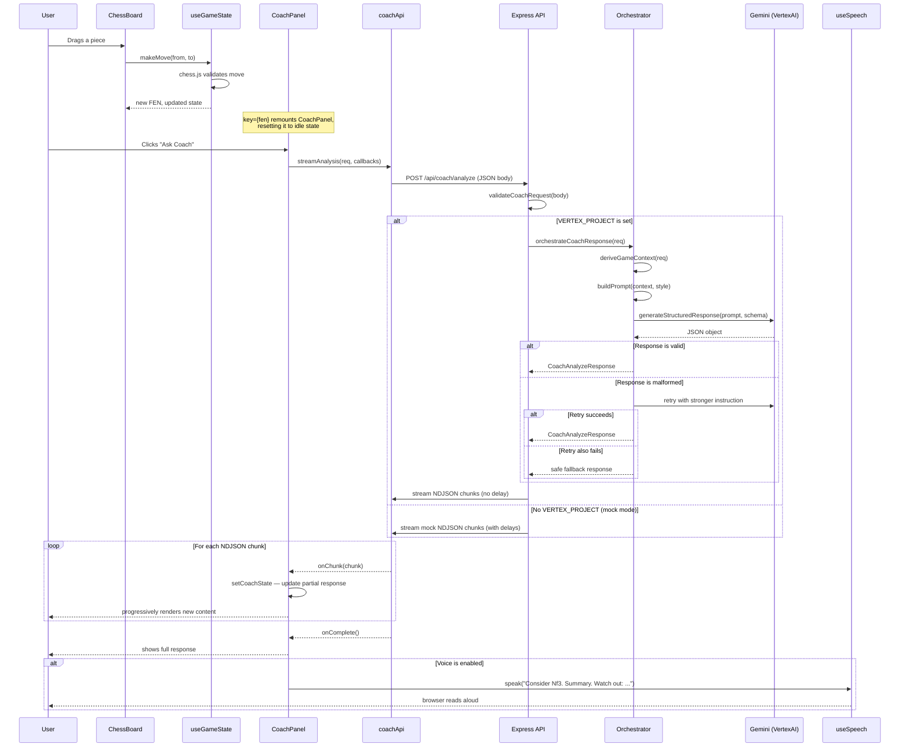

# AI Chess Copilot — Technical Guide

---

## Table of Contents

1. [What the app does](#1-what-the-app-does)
2. [Project structure](#2-project-structure)
3. [Full request flow (diagram)](#3-full-request-flow-diagram)
4. [Frontend walkthrough](#4-frontend-walkthrough)
   - 4.1 [App entry point — `App.tsx`](#41-app-entry-point--apptsx)
   - 4.2 [Board state — `useGameState.ts`](#42-board-state--usegamestatets)
   - 4.3 [The chess board — `ChessBoard.tsx`](#43-the-chess-board--chessboardtsx)
   - 4.4 [Coach panel — `CoachPanel.tsx`](#44-coach-panel--coachpaneltsx)
   - 4.5 [Streaming the response — `coachApi.ts`](#45-streaming-the-response--coachapits)
   - 4.6 [Voice readout — `useSpeech.ts`](#46-voice-readout--usespeechts)
5. [Shared types — `packages/shared`](#5-shared-types--packagesshared)
6. [Backend walkthrough](#6-backend-walkthrough)
   - 6.1 [Entry point — `index.ts`](#61-entry-point--indexts)
   - 6.2 [Route — `routes/coach.ts`](#62-route--routescoachts)
   - 6.3 [Validation — `validation/coachRequest.ts`](#63-validation--validationcoachRequestts)
   - 6.4 [Game context — `services/chessContext.ts`](#64-game-context--serviceschesscontextts)
   - 6.5 [Orchestration — `services/coachOrchestrator.ts`](#65-orchestration--servicescoachorchestratorTs)
   - 6.6 [Model client — `services/modelClient.ts`](#66-model-client--servicesmodelclientts)
   - 6.7 [Mock responses — `services/mockCoach.ts`](#67-mock-responses--servicesmockcoachts)
7. [NDJSON streaming — how progressive rendering works](#7-ndjson-streaming--how-progressive-rendering-works)
8. [The coaching mode system](#8-the-coaching-mode-system)
9. [Fallback and error handling](#9-fallback-and-error-handling)
10. [Testing strategy](#10-testing-strategy)
11. [Key design decisions and trade-offs](#11-key-design-decisions-and-trade-offs)

---

## 1. What the app does

The user plays a game of chess in the browser. After the opponent makes a move, the user can click **Ask Coach** to get AI-powered analysis of the current position. The coach responds with:

- A **recommended move** (e.g. "Nf3")
- **Alternative moves** to consider
- A one-line **summary** of the strategic idea
- **Reasoning** — why this move is best
- **Risks** — what to watch out for after playing it
- A **confidence** rating (low / medium / high)

The response streams in progressively (like ChatGPT typing), so the user sees the move immediately, then the explanation builds up.

There are three **coaching modes** the user can switch between:

- `balanced` — principled, solid advice
- `aggressive` — sharp, attacking continuations
- `defensive` — safe, risk-minimizing moves

If the AI model isn't configured (no GCP credentials), the app silently falls back to pre-written mock responses. The UI is identical either way.

---

## 2. Project structure

This is an **npm workspaces monorepo** — one `package.json` at the root manages three separate packages together.

```
AI_chess_copilot/
├── apps/
│   ├── web/                  React + Vite frontend (port 5173)
│   │   └── src/
│   │       ├── components/   UI components (ChessBoard, CoachPanel, MoveHistory)
│   │       ├── hooks/        React hooks (useGameState, useSpeech)
│   │       ├── services/     API calls (coachApi.ts)
│   │       └── test/         Vitest + React Testing Library tests
│   └── api/                  Express 5 backend (port 3001)
│       └── src/
│           ├── routes/       HTTP route handlers
│           ├── services/     Business logic (orchestrator, model client, mock)
│           ├── validation/   Request validation
│           └── test/         Vitest tests
├── packages/
│   └── shared/               TypeScript types shared between web and api
│       └── src/index.ts
├── .env.example              Template for environment variables
├── .github/workflows/ci.yml  GitHub Actions CI (runs tests on every PR)
└── package.json              Root — workspace scripts, lint, format, husky hooks
```

**Why a monorepo?** The frontend and backend share TypeScript types (like `CoachAnalyzeRequest`). Without a monorepo, you'd have to copy-paste those types or publish them to npm. With workspaces, `apps/web` and `apps/api` both import from `@ai-chess-copilot/shared` as if it were a published package — but it's just a local folder symlinked by npm.

---

## 3. Full request flow (diagram)



---

## 4. Frontend walkthrough

### 4.1 App entry point — `App.tsx`

**File:** [`apps/web/src/App.tsx`](../apps/web/src/App.tsx)

`App` is the root component. It owns two pieces of state:

- `useGameState()` — the chess board state (FEN, move history, whose turn it is)
- `coachingMode` — which style the user has selected (`"balanced"` by default)

```tsx
// App.tsx (simplified)
function App() {
  const { fen, moveHistory, sideToMove, lastOpponentMove, makeMove } =
    useGameState();
  const [coachingMode, setCoachingMode] = useState<CoachingMode>("balanced");

  return (
    <>
      <ChessBoard fen={fen} onMove={makeMove} />
      <CoachPanel
        key={fen} // ← This is important — see note below
        coachingMode={coachingMode}
        canAsk={lastOpponentMove !== null}
        fen={fen}
        moveHistory={moveHistory}
        sideToMove={sideToMove}
        lastOpponentMove={lastOpponentMove}
      />
    </>
  );
}
```

**Why `key={fen}`?** In React, when a component's `key` prop changes, React **destroys and recreates** the component from scratch. This means every time the board position changes (a new move is made), `CoachPanel` resets completely — clearing any previous analysis, loading state, or errors. This is cleaner than manually resetting state inside an effect.

---

### 4.2 Board state — `useGameState.ts`

**File:** [`apps/web/src/hooks/useGameState.ts`](../apps/web/src/hooks/useGameState.ts)

This hook owns the game. It wraps [chess.js](https://github.com/jhlywa/chess.js) — a library that knows all the rules of chess.

```ts
// The chess engine lives in a ref, not state — it's a mutable object
// that we don't want to recreate on every render.
const chessRef = useRef<Chess>(new Chess());

function makeMove(from: string, to: string, promotion?: string): boolean {
  try {
    chessRef.current.move({ from, to, promotion: promotion ?? "q" });
  } catch {
    return false; // chess.js throws if the move is illegal
  }
  setState(deriveState(chessRef.current)); // trigger re-render with new state
  return true;
}
```

`deriveState` extracts everything the UI needs from the chess engine into a plain object:

```ts
function deriveState(chess: Chess): GameState {
  const history = chess.history(); // ["e4", "e5", "Nf3", ...]
  // User is always white (V1), so opponent moves are at odd indices (1, 3, 5, ...)
  const lastOpponentMove = history.filter((_, i) => i % 2 === 1).at(-1) ?? null;

  return {
    fen: chess.fen(), // board state as a string
    moveHistory: history,
    sideToMove: chess.turn() === "w" ? "white" : "black",
    lastOpponentMove, // null until black plays
    userSide: "white",
  };
}
```

**What is FEN?** A FEN (Forsyth-Edwards Notation) string encodes the complete board position as text, e.g.:
`rnbqkbnr/pppppppp/8/8/4P3/8/PPPP1PPP/RNBQKBNR b KQkq - 0 1`
The board, castling rights, whose turn it is, and move count — all in one string. It's the universal format chess software uses to pass positions around.

---

### 4.3 The chess board — `ChessBoard.tsx`

**File:** [`apps/web/src/components/ChessBoard.tsx`](../apps/web/src/components/ChessBoard.tsx)

A thin wrapper around the `react-chessboard` library. It takes a FEN and renders the visual board. When a piece is dropped, it calls `onMove` (which is `makeMove` from `useGameState`).

```tsx
<Chessboard
  options={{
    position: fen, // draw the board from this position
    onPieceDrop: ({ sourceSquare, targetSquare }) => {
      return onMove(sourceSquare, targetSquare); // returns false = illegal, piece snaps back
    },
  }}
/>
```

The component itself has no state — it's entirely controlled by the `fen` prop passed down from `App`.

---

### 4.4 Coach panel — `CoachPanel.tsx`

**File:** [`apps/web/src/components/CoachPanel.tsx`](../apps/web/src/components/CoachPanel.tsx)

This is the most complex frontend component. It manages the four UI states of a coaching request:

| State       | What the user sees                                                       |
| ----------- | ------------------------------------------------------------------------ |
| `idle`      | "Make a move, then ask the coach for guidance."                          |
| `streaming` | Spinner, then content appears progressively as chunks arrive             |
| `complete`  | Full response: move, confidence, summary, alternatives, reasoning, risks |
| `error`     | Red error message                                                        |

All three of these values live together in one state object:

```ts
type CoachState = {
  status: "idle" | "streaming" | "complete" | "error";
  partial: Partial<CoachAnalyzeResponse>; // response built up chunk by chunk
  error: string | null;
};

const [{ status, partial, error }, setCoachState] = useState<CoachState>(IDLE);
```

**Why one object?** Keeping them separate (`useState` × 3) means resetting requires three separate calls. One object means one call: `setCoachState(IDLE)`. React also guarantees these three values are always consistent with each other.

When the user clicks **Ask Coach**:

```ts
function handleAskCoach() {
  setCoachState({ status: "streaming", partial: {}, error: null });

  streamAnalysis(req, {
    onChunk: (chunk) =>
      setCoachState((prev) => ({
        ...prev,
        partial: applyChunk(prev.partial, chunk), // merge each arriving chunk
      })),
    onComplete: () =>
      setCoachState((prev) => ({ ...prev, status: "complete" })),
    onError: (err) =>
      setCoachState({ status: "error", partial: {}, error: err.message }),
  });
}
```

`applyChunk` is a pure function that maps each NDJSON chunk type to the correct field on the partial response object:

```ts
function applyChunk(prev, chunk) {
  switch (chunk.type) {
    case "move":
      return { ...prev, recommendedMove: chunk.value };
    case "summary":
      return { ...prev, summary: chunk.value };
    case "reasoning":
      return { ...prev, reasoning: chunk.value };
    // ... etc
  }
}
```

The JSX renders each section only when its field has arrived:

```tsx
{
  partial.summary !== undefined && (
    <p className="coach-summary">{partial.summary}</p>
  );
}
```

This is what creates the "typing in" effect — sections appear one by one as their chunks arrive.

---

### 4.5 Streaming the response — `coachApi.ts`

**File:** [`apps/web/src/services/coachApi.ts`](../apps/web/src/services/coachApi.ts)

`streamAnalysis` makes the HTTP request and reads the response as a stream. The key concept: instead of waiting for the whole response, we read it byte-by-byte as it arrives.

```ts
const reader = res.body!.getReader(); // get a ReadableStream reader
const decoder = new TextDecoder(); // converts bytes → text
let buffer = "";

while (true) {
  const { value, done } = await reader.read(); // read next chunk of bytes
  if (done) break;

  buffer += decoder.decode(value, { stream: true });
  const lines = buffer.split("\n");
  buffer = lines.pop() ?? ""; // keep the last incomplete line in the buffer

  for (const line of lines) {
    const chunk = JSON.parse(line.trim()); // each complete line is one JSON object
    onChunk(chunk); // tell CoachPanel about it
  }
}
```

**Why buffer the incomplete line?** Network packets don't respect JSON boundaries. A line like `{"type":"summary","value":"Dev...` might arrive split across two packets. The buffer accumulates bytes until a full `\n`-terminated line is ready.

There's also a 15-second timeout per chunk — if the stream stalls mid-response, it cancels and calls `onError`.

---

### 4.6 Voice readout — `useSpeech.ts`

**File:** [`apps/web/src/hooks/useSpeech.ts`](../apps/web/src/hooks/useSpeech.ts)

Uses the browser's built-in [Web Speech API](https://developer.mozilla.org/en-US/docs/Web/API/Web_Speech_API) — no backend or external service needed.

```ts
const utterance = new SpeechSynthesisUtterance(
  "Consider Nf3. Develop a piece...",
);
utterance.voice = femaleVoice; // null-safe — falls back to browser default
window.speechSynthesis.speak(utterance);
```

The hook tries to find a female voice by scanning available voice names for keywords like `"samantha"` (macOS), `"zira"` (Windows), `"female"` (Android). Voices load asynchronously in Chrome (via a `voiceschanged` event) but synchronously in Safari, so both paths are handled.

In `CoachPanel`, a `useEffect` watches for `status === "complete"` and fires the speech if voice is on:

```ts
useEffect(() => {
  if (status !== "complete" || !voiceOn) return;
  speak(`Consider ${partial.recommendedMove}. ${partial.summary}. Watch out: ${partial.risks?.[0]}`);
}, [status, voiceOn, ...]);
```

---

## 5. Shared types — `packages/shared`

**File:** [`packages/shared/src/index.ts`](../packages/shared/src/index.ts)

Both the frontend and backend import from `@ai-chess-copilot/shared`. This guarantees the request format the browser sends matches what the API expects, and the response format the API returns matches what the browser renders.

```ts
// The request the frontend sends
export interface CoachAnalyzeRequest {
  fen: string;
  moveHistory: string[];
  lastOpponentMove: string | null;
  sideToMove: SideToMove;
  coachingMode: CoachingMode;
}

// One chunk of the streamed response
export type CoachStreamChunk =
  | { type: "move"; value: string }
  | { type: "alternatives"; value: string[] }
  | { type: "confidence"; value: Confidence }
  | { type: "summary"; value: string }
  | { type: "reasoning"; value: string[] }
  | { type: "risks"; value: string[] }
  | { type: "style"; value: CoachingMode };
```

`CoachStreamChunk` is a **discriminated union** — a TypeScript pattern where a `type` field tells you which shape the rest of the object has. When you `switch` on `chunk.type`, TypeScript narrows the type automatically, so `chunk.value` has the correct type in each branch.

---

## 6. Backend walkthrough

### 6.1 Entry point — `index.ts`

**File:** [`apps/api/src/index.ts`](../apps/api/src/index.ts)

Starts an Express 5 server, attaches CORS and JSON body parsing middleware, and mounts the coach router at `/api/coach`.

### 6.2 Route — `routes/coach.ts`

**File:** [`apps/api/src/routes/coach.ts`](../apps/api/src/routes/coach.ts)

The single route handler for `POST /api/coach/analyze`. Its job is to:

1. Validate the request
2. Decide real model vs. mock
3. Stream the response back

```ts
coachRouter.post("/analyze", async (req, res) => {
  const result = validateCoachRequest(req.body);
  if (!result.ok) {
    res.status(400).json({ error: "Invalid request.", details: result.errors });
    return;
  }

  if (getVertexConfig()) {
    // VERTEX_PROJECT is set — try the real model
    try {
      const response = await orchestrateCoachResponse(result.data);
      await streamResponseAsNdjson(response, res);
      return;
    } catch (err) {
      console.error("[coach] Model error, falling back to mock:", err);
      // falls through to mock below
    }
  }

  await streamMockResponse(result.data, res); // mock path
});
```

Note the fallback pattern: if the model call throws (network error, quota, etc.), the route logs it and silently serves a mock response. The user never sees an error for these transient failures.

---

### 6.3 Validation — `validation/coachRequest.ts`

**File:** [`apps/api/src/validation/coachRequest.ts`](../apps/api/src/validation/coachRequest.ts)

Validates the incoming JSON body against all required fields before touching any business logic. Returns either `{ ok: true, data }` or `{ ok: false, errors }`.

```ts
type ValidationResult =
  | { ok: true; data: CoachAnalyzeRequest }
  | { ok: false; errors: ValidationError[] };
```

This is a **discriminated union** again — the same TypeScript pattern as the stream chunks. After checking `result.ok`, TypeScript knows exactly which shape you're dealing with.

---

### 6.4 Game context — `services/chessContext.ts`

**File:** [`apps/api/src/services/chessContext.ts`](../apps/api/src/services/chessContext.ts)

Converts the raw request into a human-readable context string that goes into the prompt:

```
Position (FEN): rnbqkbnr/pppppppp/8/8/4P3/8/PPPP1PPP/RNBQKBNR b KQkq - 0 1
Playing as: black
Game phase: opening (move 1)
Recent moves: e4
Opponent's last move: e4
Coaching style requested: balanced
```

It also calculates game phase from move count:

- ≤ 10 full moves → **opening**
- 11–25 → **middlegame**
- 26+ → **endgame**

Only the last 6 half-moves are included in "Recent moves" to keep the prompt focused without noise from earlier in the game.

---

### 6.5 Orchestration — `services/coachOrchestrator.ts`

**File:** [`apps/api/src/services/coachOrchestrator.ts`](../apps/api/src/services/coachOrchestrator.ts)

This is the heart of the AI layer. It:

1. Calls `deriveGameContext` to build the context string
2. Calls `buildPrompt` to construct the full prompt
3. Calls the model and validates the output
4. Handles retry and fallback if the output is malformed

**How the prompt is built:**

Each coaching mode has a different "character" and field-level instructions:

```ts
const STYLE_INSTRUCTIONS = {
  balanced: {
    character: "You are a principled coach who values solid development...",
    moveGuidance: "Choose the most principled, structurally sound move...",
    // ...
  },
  aggressive: {
    character: "You are an attacking coach who prizes initiative...",
    moveGuidance: "Choose the sharpest, most initiative-seizing move...",
    // ...
  },
  // ...
};
```

The prompt injects these per-field, so the model gets explicit direction for each output field rather than a vague general instruction.

**Output validation and retry:**

```ts
const raw = await generateStructuredResponse(prompt, RESPONSE_SCHEMA);

if (isValidOutput(raw)) {
  return { ...raw, style: req.coachingMode }; // happy path
}

// Malformed — retry once with a stronger instruction
try {
  const retried = await generateStructuredResponse(
    prompt + RETRY_SUFFIX,
    RESPONSE_SCHEMA,
  );
  if (isValidOutput(retried)) return { ...retried, style: req.coachingMode };
} catch {
  /* retry failed */
}

// Both attempts failed — build a safe response from whatever partial data we have
return { ...toSafeResponse(raw), style: req.coachingMode };
```

`isValidOutput` checks that all required fields exist and have the right types. `toSafeResponse` salvages whatever valid fields came back and fills in safe defaults for the rest (e.g. `"—"` for a missing move, `"low"` for a missing confidence).

---

### 6.6 Model client — `services/modelClient.ts`

**File:** [`apps/api/src/services/modelClient.ts`](../apps/api/src/services/modelClient.ts)

A thin wrapper around the Google Cloud `@google-cloud/vertexai` SDK. The key feature: **structured JSON output**.

```ts
const result = await model.generateContent({
  contents: [{ role: "user", parts: [{ text: prompt }] }],
  generationConfig: {
    responseMimeType: "application/json", // ← tells Gemini to respond with JSON
    responseSchema: schema, // ← JSON schema constraining the output shape
  },
});
```

By passing a JSON schema, we're telling Gemini exactly what shape the response must be. This dramatically reduces malformed output compared to asking the model to "respond in JSON format" in the prompt text. The orchestrator's validation layer catches the remaining cases.

`getVertexConfig()` reads environment variables and returns `null` if `VERTEX_PROJECT` isn't set. The route uses this as the signal to skip the model entirely:

```ts
if (getVertexConfig()) {
  /* real model */
} else {
  /* mock */
}
```

---

### 6.7 Mock responses — `services/mockCoach.ts`

**File:** [`apps/api/src/services/mockCoach.ts`](../apps/api/src/services/mockCoach.ts)

Pre-written responses for each coaching mode. Used when there are no GCP credentials, or as a fallback if the model errors.

`streamMockResponse` emits the same 7 NDJSON chunks as the real path, but with artificial delays (300ms for the move, 250ms for alternatives, etc.) to simulate the model typing in progressively. This means the mock and real paths produce identical UX — the frontend can't tell the difference.

```ts
const SECTION_DELAYS = {
  move: 300,
  alternatives: 250,
  confidence: 150,
  summary: 400,
  reasoning: 500,
  risks: 400,
  style: 0,
};
```

---

## 7. NDJSON streaming — how progressive rendering works

**NDJSON** (Newline-Delimited JSON) means each line of the HTTP response body is a complete, independently parseable JSON object.

```
{"type":"move","value":"Nf3"}\n
{"type":"alternatives","value":["Bc4","d4"]}\n
{"type":"confidence","value":"medium"}\n
{"type":"summary","value":"Develop a knight..."}\n
...
```

The server writes each line and flushes immediately. The browser receives them one by one (in order) as the server emits them. This is different from:

- **Regular JSON response** — the browser waits for the entire body before parsing anything
- **Server-Sent Events (SSE)** — similar idea but requires a `GET` request; POST with NDJSON is simpler
- **WebSocket** — bidirectional; overkill for a one-shot analysis request

The result: the user sees the recommended move appear almost immediately, then the explanation builds up as subsequent chunks arrive. Perceived latency is much lower even if total response time is the same.

---

## 8. The coaching mode system

The three coaching modes (`balanced`, `aggressive`, `defensive`) are **prompt-level behavior** — there are no separate code paths or logic branches. The only thing that changes is the text sent to the model.

Each mode has four text fields in `STYLE_INSTRUCTIONS`:

| Field                                | Purpose                                                    |
| ------------------------------------ | ---------------------------------------------------------- |
| `character`                          | Sets the coach's persona ("You are an attacking coach...") |
| `moveGuidance`                       | Instructions for how to pick `recommendedMove`             |
| `altGuidance`                        | Instructions for how to pick `alternativeMoves`            |
| `reasoningGuidance` / `riskGuidance` | Tone and emphasis for those fields                         |

By injecting different instructions per field, the model gets concrete direction rather than vague style hints. The mock responses also reflect the three modes — each has a different hardcoded move and reasoning style.

---

## 9. Fallback and error handling

There are three layers of fallback, each catching a different class of failure:

```
Layer 1: Route fallback
  Model throws (network, quota, auth) → silently serve mock response

Layer 2: Orchestrator retry
  Model returns malformed JSON → retry once with a stronger instruction

Layer 3: Safe response
  Both model attempts return malformed JSON → toSafeResponse() builds
  a partial response from whatever valid fields came back
```

The result: the client always gets a response. The error path for the user only triggers if the entire backend fails (network error, server crash). Transient AI failures are completely invisible.

---

## 10. Testing strategy

Tests live alongside the code they test, under `src/test/` in each app.

**Frontend** (`apps/web`) — Vitest + React Testing Library:

- Component tests use `render()` and assert on DOM output
- `streamAnalysis` is mocked with `vi.mock` — tests never make real HTTP calls
- Streaming is simulated by calling `callbacks.onChunk()` synchronously in the mock
- State reset tests verify that `key={fen}` correctly remounts the panel

**Backend** (`apps/api`) — Vitest + supertest:

- Route tests use supertest to make real HTTP requests against the Express app
- `generateStructuredResponse` is mocked — orchestrator tests never call the real model
- Validation tests cover all invalid input combinations
- Orchestrator tests cover the retry logic and safe fallback path

**Run all tests:**

```bash
npm test             # web + api
npm run test:web     # frontend only
npm run test:api     # backend only
```

The pre-push git hook runs the full test suite before every push, so broken tests never reach the remote.

---

## 11. Key design decisions and trade-offs

| Decision                              | Why                                                                     | Trade-off                                                           |
| ------------------------------------- | ----------------------------------------------------------------------- | ------------------------------------------------------------------- |
| NDJSON over POST instead of SSE       | Simpler — no special event-stream handling, works with standard `fetch` | SSE has native browser reconnect; NDJSON doesn't                    |
| `key={fen}` to reset state            | Eliminates a `useEffect` that called `setState` (React anti-pattern)    | Remounting destroys and recreates DOM — acceptable cost here        |
| Single `CoachState` object            | One `setState` call instead of three — avoids cascading renders         | Slightly less granular updates                                      |
| Structured JSON output schema         | Dramatically reduces malformed model output vs. free-form prompting     | Schema constrains the model's output format but not content quality |
| Mock fallback for missing credentials | Frontend development works without a GCP account                        | Mock responses don't reflect real AI quality                        |
| Prompt-level coaching modes           | No separate logic branches — simple to add new modes                    | Model may not reliably follow style instructions on every response  |
| `USER_SIDE = "white"` constant        | Flipping user side later requires changing one line                     | V1 only works as White                                              |

---

Good luck and feel free to reach out if you need any clarification or would like to contribute further. Always happy to help. Thanks!

---

**Document Version:** 1.0  
**Last Updated:** April, 2026  
**Maintainer:** Cashley <cashley.dps@gmail.com>
